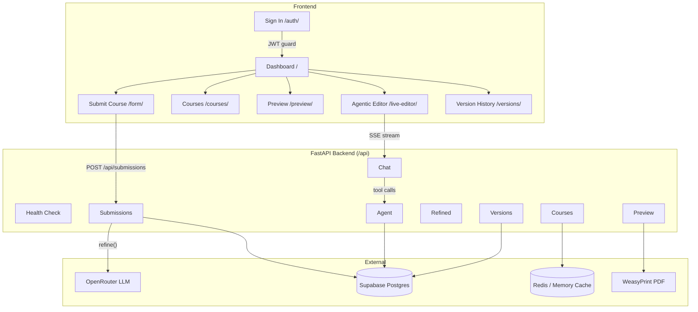
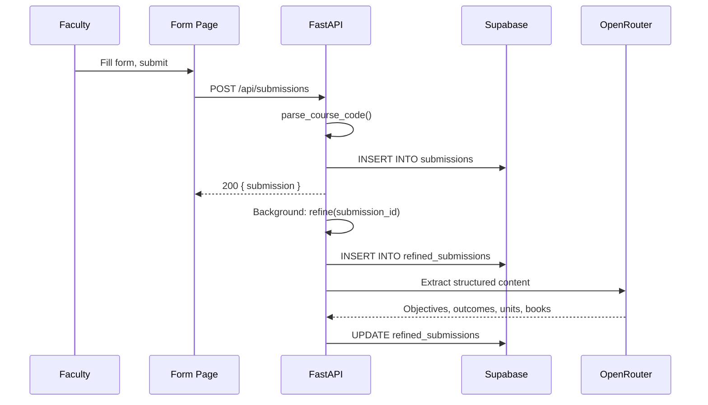
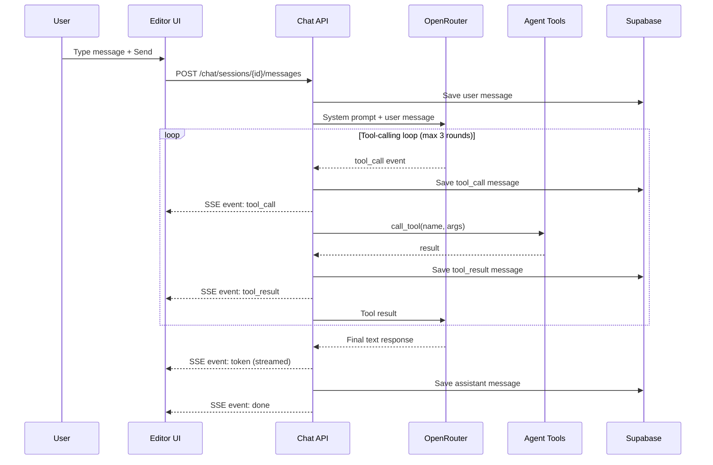
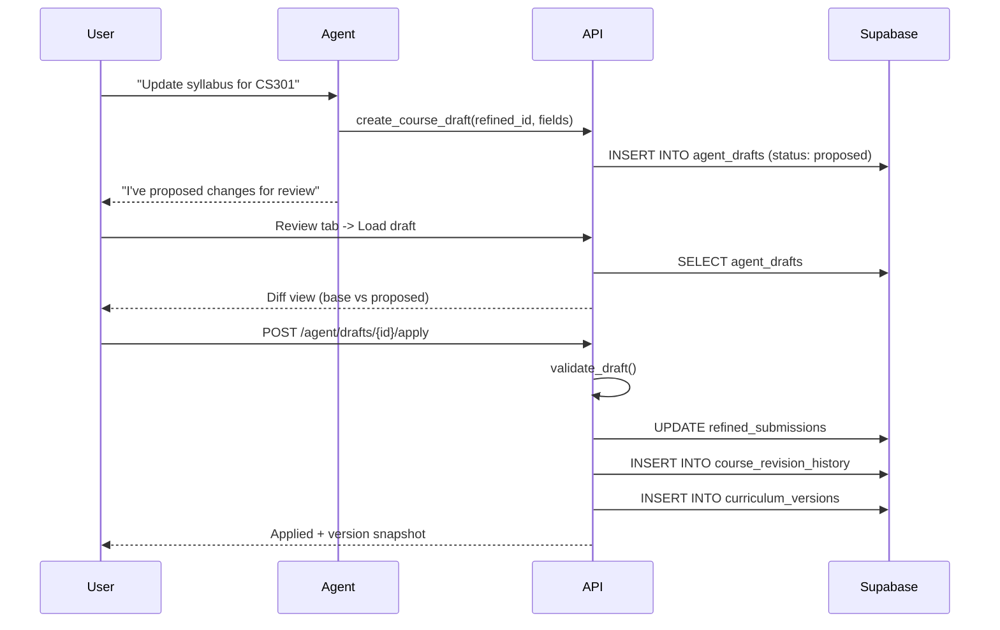

# Architecture Overview

## System Architecture

## Data Flow Sequences

### Submission Flow

### Chat & Tool Calling

### Draft Lifecycle

## Layer Responsibilities

| Layer | Location | Responsibility |
|-------|----------|----------------|
| Static frontend | `frontend/` | Course entry, course management, PDF preview, agentic editor, version history |
| API backend | `backend/app/` | FastAPI routes, validation, refinement, previews, drafts, chat, snapshots |
| Persistence | Supabase Postgres | Raw submissions, refined courses, agent drafts, chat history, attachments, curriculum versions |
| Cache | Redis + in-memory | Course lists, version lists, PDFs, with lazy invalidation |
| Rendering | Jinja2 + WeasyPrint | Curriculum summary pages, course detail pages, PDF exports |
| Model provider | OpenRouter | Submission refinement and live-editor chat with tool calls + fallback model retry |

The backend serves the frontend as static files and mounts the API under `/api`. There is no Node build step on the frontend.

## Tech Stack

| Component | Technology | Purpose |
|-----------|------------|---------|
| Backend framework | FastAPI 0.138 + Uvicorn | ASGI server, routing, validation |
| Language | Python 3.12 | Runtime |
| Frontend | Vanilla HTML/CSS/JS | No build step, served as static files |
| Database | Supabase (PostgreSQL) | Persistent storage for all data |
| Cache | Upstash Redis (optional) | Serverless Redis; falls back to in-memory dict |
| LLM provider | OpenRouter | Streaming + tool calling, fallback model retry |
| PDF engine | WeasyPrint | A4 curriculum PDFs from Jinja2 HTML |
| Templating | Jinja2 | Curriculum layout, course pages, diffs |
| HTTP client | httpx | Async requests to OpenRouter and external URLs |
| Spreadsheet parsing | openpyxl | Reading uploaded .xlsx files for text extraction |
| Markdown rendering | marked.js (CDN) | Agent chat message rendering in browser |
| HTML sanitization | DOMPurify (CDN) | Sanitizing agent-generated HTML |
| PDF text extraction | poppler-utils (pdftotext) | Extracting text from uploaded PDF attachments |
| Auth | Supabase Auth (JWT) | Browser-based authentication |
| Error tracking | Sentry SDK (optional) | Production error monitoring |
| Deployment | Docker on HF Spaces | Backend at port 7860 |
| Frontend deploy | Vercel | Static hosting with `/api` rewrite to backend |

## Project Structure

### Backend (`backend/app/`)

| Path | Responsibility |
|------|----------------|
| `main.py` | FastAPI app, CORS, Supabase/`.env` loading, mounts `/api` routers and the static frontend |
| `api.py` | Aggregates all route routers under a single `/api` router |
| `supabase.py` | Supabase client + `first_row()` helper |
| `cache.py` | Dual cache (Redis + in-memory), lazy invalidation, prefix-based deletion |
| `models/submission.py` | `CourseSubmission` (request contract) and `parse_course_code()` |
| `services/deterministic.py` | `compute_hours`, `compute_program`, `compute_course_type` from credit category |
| `services/refinement.py` | The LLM refinement pipeline (`refine`) |
| `services/curriculum.py` | Sorting, ordering, version snapshots, draft records, field updates |
| `services/diffing.py` | JSON diff, protected-field validation, patch apply/merge |
| `services/preview.py` | `build_course_preview`, `build_specialization_context` |
| `services/rendering.py` | Jinja2 environment, filters, `SEMESTER_NAMES` global |
| `services/agent_tools.py` | Agent tool definitions + `TOOLS` registry (35 tools) + `call_tool` |
| `services/openrouter.py` | `call()` (one-shot), `stream_chat()` (tool-calling loop), fallback model retry |
| `services/schema.py` | `REQUIRED_TABLES` and `schema_status()` |
| `services/errors.py` | `database_http_exception()` |
| `services/attachments.py` | Text extraction from PDF/DOCX/XLSX/TXT |
| `services/books.py` | `parse_books()` textbook parser |
| `routes/health.py` | `GET /api/health/schema` |
| `routes/submissions.py` | `POST /api/submissions`, `POST /api/submissions/{id}/refine` |
| `routes/preview.py` | Course/HTML/PDF preview endpoints (8 endpoints) |
| `routes/refined.py` | `GET`/`PATCH` a single refined course |
| `routes/courses.py` | List + toggle visibility + soft-delete refined courses |
| `routes/agent.py` | Draft + document-draft + tool endpoints (13 endpoints) |
| `routes/chat.py` | Chat sessions, SSE streaming, attachments, system prompt |
| `routes/versions.py` | Version CRUD, restore, previews, diffs (10 endpoints) |
| `templates/jinja_sample.html` | Single course + full document renderer + title page |
| `templates/jinja_program.html` | Program-level title page (large seal) + PEOs/POs |
| `templates/jinja_1_to_8.html` | Semester summary tables (1-4, 7-8) |
| `templates/jinja_sem_5_6.html` | Semester 5/6 electives + specialization tables |
| `templates/jinja_diff.html` | Structured diff renderer for drafts |

### Frontend (`frontend/`)

| Path | Purpose |
|------|---------|
| `index.html` | Dashboard hub linking to all surfaces |
| `form/` | Raw course submission form with course code parsing |
| `courses/` | Refined course list with filtering, visibility toggle, soft delete |
| `preview/` | Overall or per-semester PDF preview/download |
| `live-editor/` | Agentic Editor: course preview, chat assistant, JSON editor, draft review, version restore |
| `versions/` | Snapshot list, preview, comparison, editor handoff |
| `auth/` | Sign in (Supabase Auth) |
| `shared/` | `auth-guard.js`, `supabase-client.js`, `shared.css`, `dialog.js` |

### Tests (`tests/`)

29 pytest files covering deterministic mapping, refinement helpers, preview rendering, agent diffing/protected fields/tooling, OpenRouter streaming, static frontend routes, Supabase schema checks, attachment extraction, cache invalidation, and benchmark tests. The full run is fast and runs in CI.

### Docs (`docs/`)

- `index.md` -- this file (GitHub Pages site)
- `schema.sql` -- the canonical Supabase schema (run it in the SQL editor)

### `.nottracked/`

Personal reference files (SQL dumps, PDFs, scratch notes). Never committed.