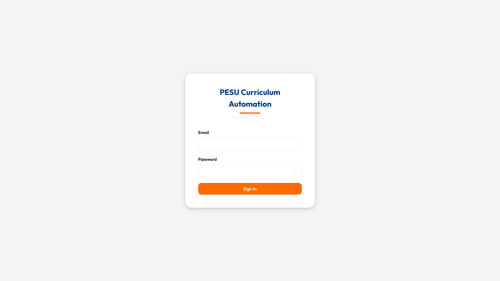
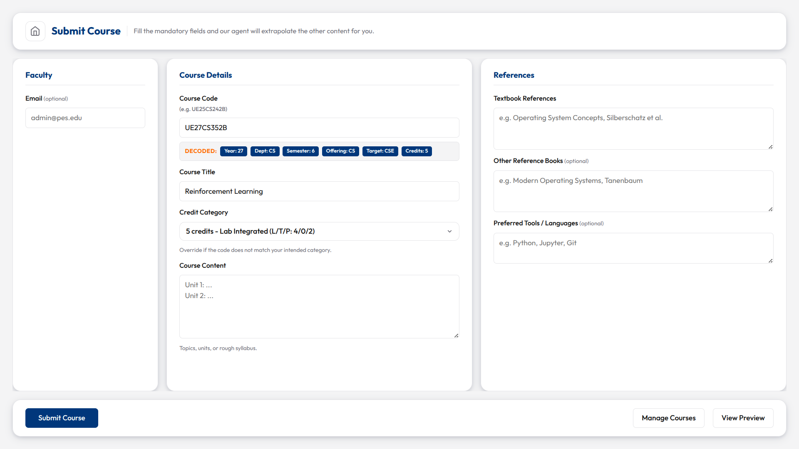
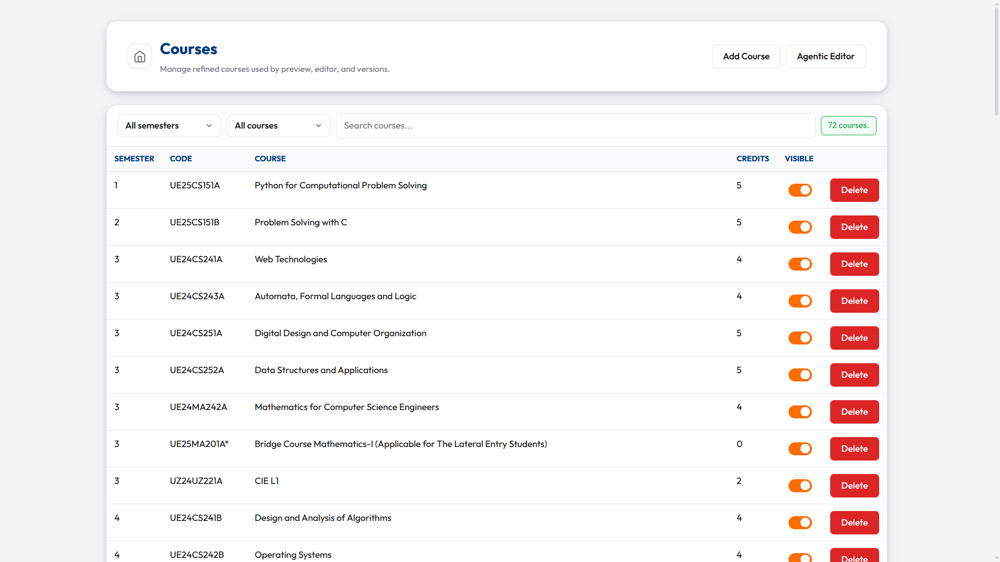
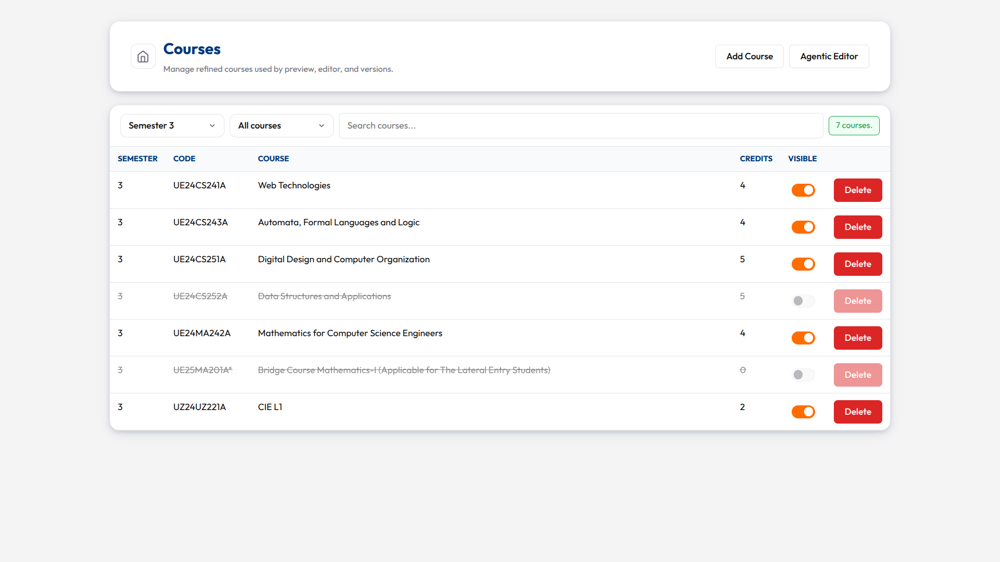
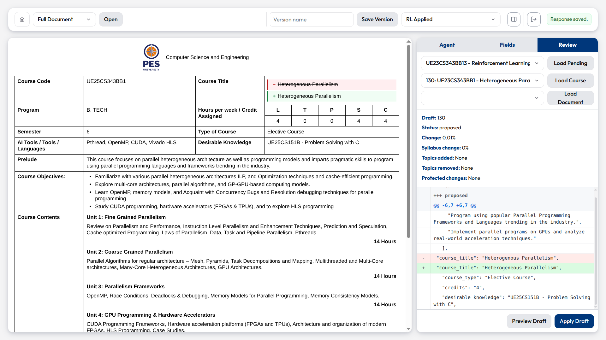
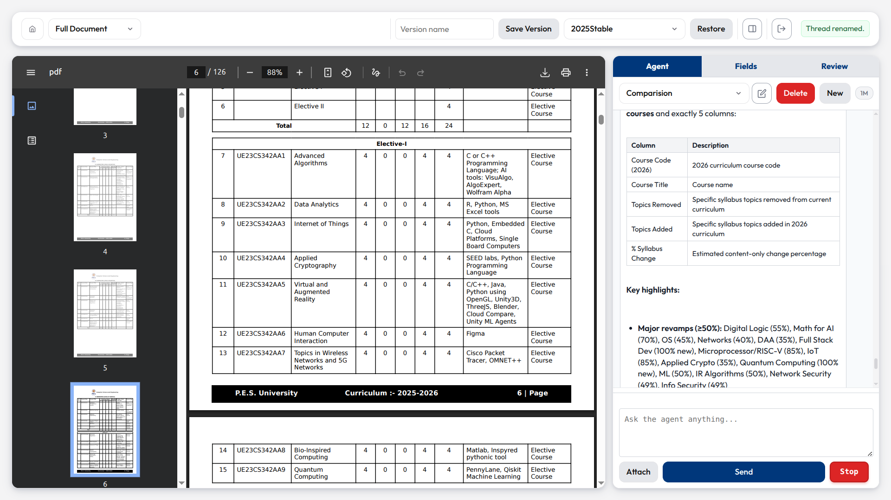
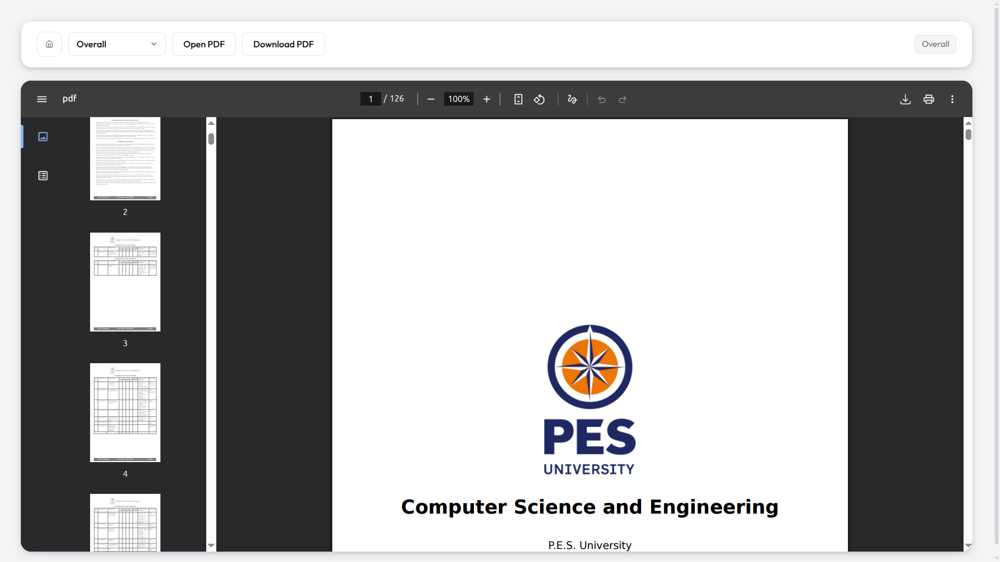
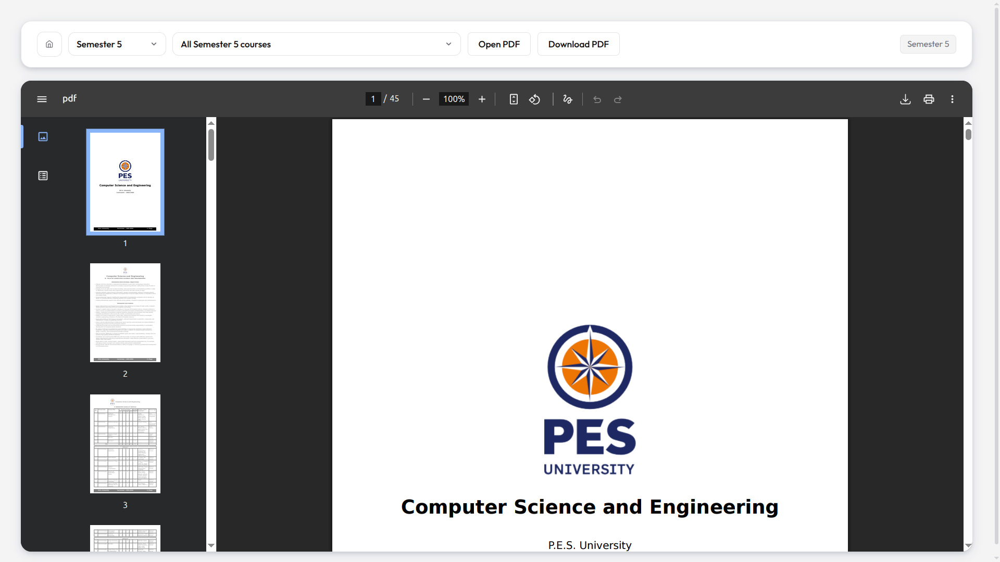
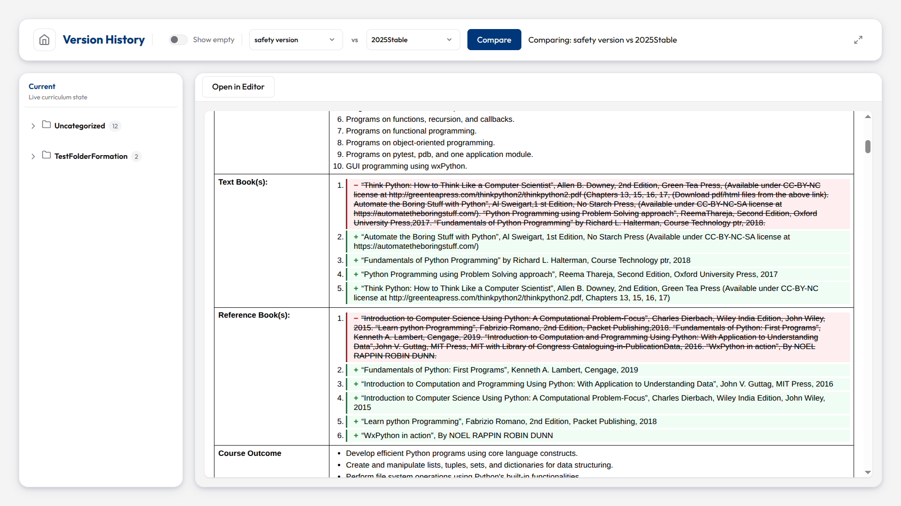
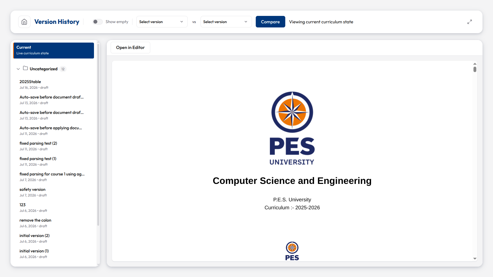

# Screenshots

Visual overview of every surface in Syntagma.

---

## Sign In

---

## Dashboard

---

## Course Submission

---

## Courses Management

---

## Agentic Editor

---

## PDF Preview

---

## Version History

